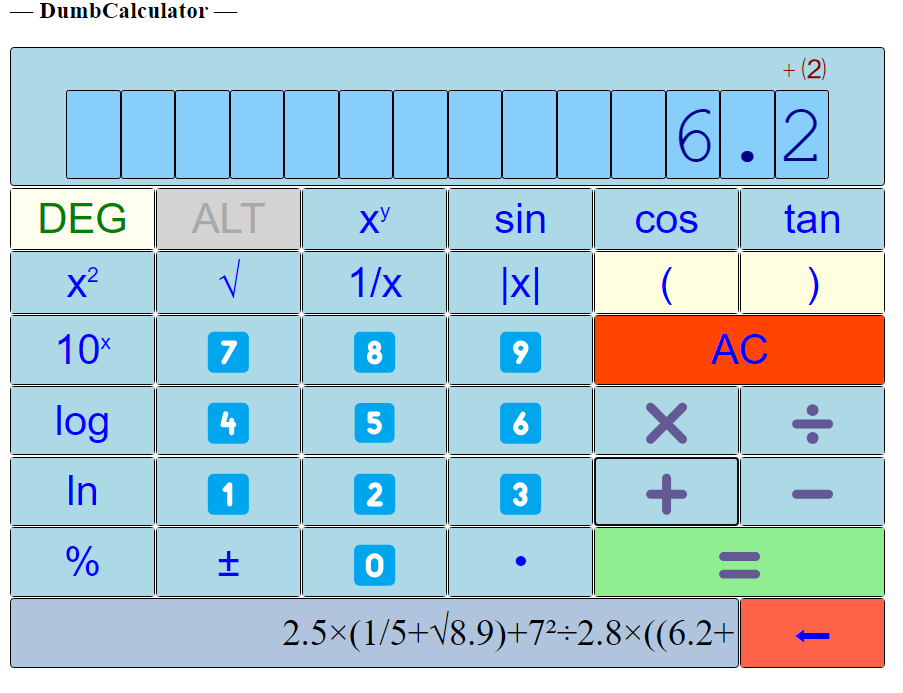

# [RustyDumbTools](https://github.com/trevorwslee/rusty_dumb_tools) (v0.1.15)

A collection of [simple tools in ***Rust***](https://crates.io/crates/rusty_dumb_tools) as ***Rust*** modules:
* [`crate::progress::DumbProgressIndicator`](https://docs.rs/rusty_dumb_tools/latest/rusty_dumb_tools/progress/struct.DumbProgressIndicator.html):
  A simple `Iterator` wrapper that helps to show progress of the iteration.
* [`crate::arg::DumbArgParser`](https://docs.rs/rusty_dumb_tools/latest/rusty_dumb_tools/arg/struct.DumbArgParser.html):
  A simple argument parser.
  It can be useful for handling command line argument parsing for a ***Rust*** program.
* [`crate::json::DumbJsonProcessor`](https://docs.rs/rusty_dumb_tools/latest/rusty_dumb_tools/json/struct.DumbJsonProcessor.html):
  A simple JSON processor / stream parser, that processes input JSON (possibly streamed piece by piece).
  Instead of returning the parsed JSON as some object; as soon as JSON entries are recognized,
  the configured callback is called for those recognized JSON entries. 
* [`crate::calc::DumbCalcProcessor`](https://docs.rs/rusty_dumb_tools/latest/rusty_dumb_tools/calc/index.html):
  A simple infix calculation processor 
  It can be used to implement a simple calculator in ***Rust***.
* [`crate::calculator::DumbCalculator`](https://docs.rs/rusty_dumb_tools/latest/rusty_dumb_tools/calculator/struct.DumbCalculator.html):
  A simple calculator that accepts input keys acting like a real calculator.
  It can be used to implement a simple calculator UI in **Rust**.
* [`crate::ltemp::DumbLineTemplate`](https://docs.rs/rusty_dumb_tools/latest/rusty_dumb_tools/ltemp/struct.DumbLineTemplate.html):
  A simple line template for formatting a line.
  It can be usee for printing values as a line with some template.
* [`crate::lblscreen::DumbLineByLineScreen`](https://docs.rs/rusty_dumb_tools/latest/rusty_dumb_tools/lblscreen/struct.DumbLineByLineScreen.html):
  A terminal / text-based "screen" update helper.
  It is extended from `crate::ltemp::DumbLineTemplate`, and should be helpful in managing the updates of the formatted lines that acts as a "screen".
 
## Sample Code for `DumbProgressIndicator`

### Simple:
```
use rusty_dumb_tools::prelude::*;
pub fn try_simple_progress_range() {
    for i in dpir!(0..6, name = "RANGE", desc = "demo iteration of range") {
        println!(" i is {}", i);
        thread::sleep(Duration::from_millis(1000));
    }
}
```
Note that `dpir` is a macro for wrapping the `Range` (`0..6`) into a `DumbProgressIndicator` object, which implements `Iterator` trait so that it can be used in *for* construct.

The output will be like
```
💠 RANGE: 1/6 🌑🌓🌕🌕🌕🌕🌕🌕🌕🌕 – demo iteration of range 💠 …  i is 0
💠 RANGE: 2/6 🌑🌑🌑🌕🌕🌕🌕🌕🌕🌕 – demo iteration of range 💠 …  i is 1
💠 RANGE: 3/6 🌑🌑🌑🌑🌑🌕🌕🌕🌕🌕 – demo iteration of range 💠 …  i is 2
💠 RANGE: 4/6 🌑🌑🌑🌑🌑🌑🌓🌕🌕🌕 – demo iteration of range 💠 …  i is 3
💠 RANGE: 5/6 🌑🌑🌑🌑🌑🌑🌑🌑🌕🌕 – demo iteration of range 💠 …  i is 4
💠 RANGE: 6/6 🌑🌑🌑🌑🌑🌑🌑🌑🌑🌑 – demo iteration of range 💠 …  i is 5
```

### Nested:
```
use rusty_dumb_tools::prelude::*;
pub fn try_nested_progress() {
    for i in dpir!(0..3, name = "RANGE") {
        let items = vec![
            String::from("apple"),
            String::from("banana"),
            String::from("orange"),
        ];
        for item in dpi_iter!(items, name = "VECTOR") {
            println!(" i is {}; item is {}", i, item);
            thread::sleep(Duration::from_millis(1000));
        }
    }
}
```
Note that `dpi_iter` is a macro for wrapping `Vec` (`items.iter()`) into a `DumbProgressIndicator` object, which implements `Iterator` trait so that it can be used in *for* construct.

The output will be like
```
💠 RANGE: 1/3 🌑🌑🌑🌕🌕🌕🌕🌕🌕🌕 💠 VECTOR: 1/3 🌑🌑🌑🌕🌕🌕🌕🌕🌕🌕 💠 …  i is 0; item is apple
💠 RANGE: 1/3 🌑🌑🌑🌕🌕🌕🌕🌕🌕🌕 💠 VECTOR: 2/3 🌑🌑🌑🌑🌑🌑🌓🌕🌕🌕 💠 …  i is 0; item is banana
💠 RANGE: 1/3 🌑🌑🌑🌕🌕🌕🌕🌕🌕🌕 💠 VECTOR: 3/3 🌑🌑🌑🌑🌑🌑🌑🌑🌑🌑 💠 …  i is 0; item is orange
💠 RANGE: 2/3 🌑🌑🌑🌑🌑🌑🌓🌕🌕🌕 💠 VECTOR: 1/3 🌑🌑🌑🌕🌕🌕🌕🌕🌕🌕 💠 …  i is 1; item is apple
💠 RANGE: 2/3 🌑🌑🌑🌑🌑🌑🌓🌕🌕🌕 💠 VECTOR: 2/3 🌑🌑🌑🌑🌑🌑🌓🌕🌕🌕 💠 …  i is 1; item is banana
💠 RANGE: 2/3 🌑🌑🌑🌑🌑🌑🌓🌕🌕🌕 💠 VECTOR: 3/3 🌑🌑🌑🌑🌑🌑🌑🌑🌑🌑 💠 …  i is 1; item is orange
💠 RANGE: 3/3 🌑🌑🌑🌑🌑🌑🌑🌑🌑🌑 💠 VECTOR: 1/3 🌑🌑🌑🌕🌕🌕🌕🌕🌕🌕 💠 …  i is 2; item is apple
💠 RANGE: 3/3 🌑🌑🌑🌑🌑🌑🌑🌑🌑🌑 💠 VECTOR: 2/3 🌑🌑🌑🌑🌑🌑🌓🌕🌕🌕 💠 …  i is 2; item is banana
💠 RANGE: 3/3 🌑🌑🌑🌑🌑🌑🌑🌑🌑🌑 💠 VECTOR: 3/3 🌑🌑🌑🌑🌑🌑🌑🌑🌑🌑 💠 …  i is 2; item is orange
```

 
## Sample Code for `DumbArgParser`

```
use rusty_dumb_tools::prelude::*;
pub fn arg_parser_sample(provide_sample_args: bool) {
    let mut parser = DumbArgParser::new();
    parser.set_description("This is a simple argument parser.");
    dap_arg!("-v", flag2 = "--verbose", fixed = true).add_to(&mut parser); // argument flag "-v" / "--verbose" with fixed value (true) when the flag is present
    dap_arg!("-n", flag2 = "--name", default = "nobody").add_to(&mut parser); // argument "-n" / "--name" requiring input value, with default "nobody"
    dap_arg!("str-arg").add_to(&mut parser); // positional argument "str-arg" (of type String)
    dap_arg!("i32-arg", value = 123).add_to(&mut parser); // positional argument "i32-arg" of type i32 (inferred from the value 123)
    dap_arg!("multi-arg").set_multi().add_to(&mut parser); // positional multi-argument "multi-arg" that will accept multiple values (one + rest)
    if provide_sample_args {
        let in_args: Vec<&str> = vec!["-v", "STR", "888", "m1", "m2", "m3"]; // explicitly provide arguments
        parser.process_args(in_args); // parse from command-line arguments
    } else {
        parser.parse_args(); // parse from command-line arguments
    }
    println!(". -v: {:?}", parser.get::<bool>("-v"));
    println!(". --verbose: {:?}", parser.get::<bool>("--verbose")); // will be the same parameter value as "-v"
    println!(". --name: {:?}", parser.get::<String>("--name")); // can use "-n" as well
    println!(". str-arg: {:?}", parser.get::<String>("str-arg"));
    println!(". i32-arg: {:?}", parser.get::<i32>("i32-arg"));
    println!(". multi-arg: {:?}", parser.get_multi::<String>("multi-arg"));
}
```

If run with `provide_sample_args` set to `false`, i.e. no arguments provided, output will be like
```
| !!!
| !!! INVALID INPUT ARGUMENT: argument [str-arg] not provided
| !!!
| USAGE: rusty_dumb_tools [-h] [-v] [-n name] <str-arg> <i32-arg> <multi-arg>
| : This is a simple argument parser.
| . -h, --help : HELP
| . -v, --verbose : FLAG [true]
| . -n name, --name name : OPTIONAL; default [nobody]
| . <str-arg> : REQUIRED; e.g.
| . <i32-arg> : REQUIRED; e.g. 123
| . <multi-arg> ... : REQUIRED; e.g.  ...
```
If run with `provide_sample_args` set to `true`, output will be like
```
. -v: Some(true)
. --verbose: Some(true)
. --name: Some("nobody")
. str-arg: Some("STR")
. i32-arg: Some(888)
. multi-arg: Some(["m1", "m2", "m3"])
```

<p>
<details>
<summary>Next section will present a demo program of using the tools. The sub-demo "selection" is actually implemented using `DumbArgParser` with "sub-selection" for the selected sub-demo like
</summary>
<pre>
use rusty_dumb_tools::prelude::*;
pub fn run_demo() {
    let mut parser = create_demo_parser();
    parser.parse_args();
    handle_sub_demo(parser);
}
pub fn create_demo_parser() -> DumbArgParser {
    let mut parser = DumbArgParser::new();
    parser.set_description("Demos of rusty_dumb_tools.");
    dap_arg!("demo", value = "calc")
        .set_description("a demo")
        .set_with_desc_enums(vec![
            "calc:DumbCalcProcessor command-line input demo",
            ...
        ])
        .set_rest()
        .add_to(&mut parser)
        .unwrap();
    parser
}
pub fn handle_sub_demo(parser: DumbArgParser) {
    let demo = match parser.get::<String>("demo") {
        Some(t) => t,
        None => {
            panic!("No demo specified.");
        }
    };
    match demo.as_str() {
        "calc" => {
            let mut demo_parser = create_demo_calc_parser();
            parser.process_rest_args("demo", &mut demo_parser);
            handle_demo_calc(demo_parser);
        }
        ...
        _ => panic!("Unknown sub-demo: {}", demo),
    };
}
fn create_demo_calc_parser() -> DumbArgParser {
    let mut parser = DumbArgParser::new();
    parser.set_description("DumbCalcProcessor command-line input demo.");
    dap_arg!("input", value = "123")
        .set_multi()
        .set_description("infix expression")
        .add_to(&mut parser)
        .unwrap();
    parser
}
pub fn handle_demo_calc(parser: DumbArgParser) {
    let input = parser.get_multi::<String>("input").unwrap();
    ...
}
</pre>
</details>
</p>


# Demo Program

For a demo program that demonstrates more of the tools, you may want to run the included demo function [`rusty_dumb_tools::demo::run_demo`](https://docs.rs/rusty_dumb_tools/latest/rusty_dumb_tools/demo/fn.run_demo.html) like
```
use rusty_dumb_tools::demo;
demo::run_demo(None);  // get arguments from command-line         
````

Assuming new ***Rust*** project with `Cargo.toml` and `main.rs` like

`Cargo.toml`
```
...
[dependencies]
rusty_dumb_tools = "0.13"
...
```

`main.rs`
```
use rusty_dumb_tools::demo;
fn main() {
    demo::run_demo(None);
}
```
the demo can be ***cargo*** run like
* `cargo run -- -h`
  <br>the input demonstrates using `DumbArgParser` for showing "help message"
* `cargo run -- calc -h`
  <br>`DumbArgParser` is set up to parse arguments for a sub-command (with another `DumbArgParser` object);
  and the above input demonstrates showing of "help message" of the sub-command
* `cargo run -- calc 1.1 + 2.2 * (4.3 - 2.4) + 5`
  <br>the above demonstrates how to use a [sub-command] `DumbArgParser` to parse arguments for the sub-command `calc`,
  which in turn will show how to use `DumbCalcProcessor` for performing calculation of the sub-command arguments
* `cargo run -- calc-repl`
  <br>the above demonstrates how to invoke the sub-command `calc-repl`, which in turn show how `DumbCalcProcessor` like a REPL
* `cargo run -- ltemp Trevor`
  <br>the above demonstrates how to use `DumbLineTemplate` to format lines to show data
* `cargo run -- lblscreen`
  <br>the above demonstrates how to use `DumbLineByLineScreen` to implement a "progress info panel"
* `cargo run -- arg -f 0.2 5 --string2 VAL1 false 1 2 3`


The output of running `cargo run -- -h`:
```
| USAGE: rusty_dumb_tools [-h] <demo>
| : Demos of rusty_dumb_tools.
| . -h, --help : HELP
| . <demo> ... : REQUIRED; e.g. calc ...
|   : a demo
|   : . [json] : DumbJsonProcessor demo
|   : . [calc] : DumbCalcProcessor command-line input demo
|   : . [calc-repl] : DumbCalcProcessor REPL demo
|   : . [ltemp] : DumbLineTemplate demo
|   : . [lblscreen] : DumbLineByLineScreen demo
|   : . [arg] : DumbArgParser demo (more like debugging)
```

## Demo for `DumbJsonProcessor` -- `json`

After running `cargo run -- json 'hong kong'`,
which will query the info about universities of some country with API provided by [universities.hipolabs.com](http://universities.hipolabs.com/),
the screen will show something like
```
*** query universities of country: [hong kong] ...
* `name` => `Hong Kong Chu Hai College`
* `name` => `City University of Hong Kong`
* `name` => `The Chinese University of Hong Kong`
* `name` => `The Hong Kong Academy for Performing Arts`
* `name` => `Hong Kong Baptist University`
* `name` => `Hong Kong Shue Yan University`
* `name` => `The University of Hong Kong`
* `name` => `Lingnan University`
* `name` => `Hong Kong Metropolitan University`
* `name` => `The Hong Kong Polytechnic University`
* `name` => `The Hong Kong University of Science and Technology`
* `name` => `The Education University of Hong Kong`
* `name` => `The Hang Seng University of Hong Kong`
* `name` => `Canadian International School of Hong Kong`
```
<p>
<details>
<summary><b>The core for the above <i>DumbJsonProcessor</i> demo is like</b></summary>
<pre>
use rusty_dumb_tools::prelude::*;
pub fn demo_query_universities(country: &str, show_all: bool) {
    let stream = make_connection(&country);
    let result = match stream {
        Ok(mut stream) => process_connection(&mut stream, show_all),
        Err(e) => Err(format!("XXX error: [{}]", e)),
    };
    match result {
        Ok(_) => {}
        Err(e) => {
            println!("{}", e);
        }
    }
}
fn make_connection(country: &str) -> Result<TcpStream, Error> {
    let mut stream: TcpStream = TcpStream::connect("universities.hipolabs.com:80")?;
    let request = format!(
        "GET /search?country={} HTTP/1.1\r\nHost: universities.hipolabs.com\r\nAccept: application/json\r\nConnection: close\r\n\r\n",
        country.replace(" ", "%20")
    );
    stream.write_all(request.as_bytes())?;
    Ok(stream)
}
fn make_connection_get_response(country: &String) -> Result<String, Error> {
    match make_connection(country) {
        Ok(mut stream) => {
            let mut response = String::new();
            stream.read_to_string(&mut response)?;
            Ok(response)
        }
        Err(e) => Err(e),
    }
}
fn process_connection(stream: &mut TcpStream, show_all: bool) -> Result<(), String> {
    let mut handler = InPlaceJsonEntryHandler::new(move |json_entry| {
        let show = show_all || json_entry.field_name == "name";
        if show {
            println!(
                "* `{}` => `{}`",
                json_entry.field_name, json_entry.field_value
            );
        }
    });
    let mut json_processor = DumbJsonProcessor::new(Box::new(&mut handler));
    let mut progress = ProcessJsonProgress::new();
    let mut buf = [0; 32];
    loop {
        match stream.read(&mut buf) {
            Ok(size) => {
                if size == 0 {
                    return Ok(());
                }
                let bytes = &buf[..size];
                json_processor.push_json_bytes(bytes, &mut progress);
            }
            Err(e) => {
                return Err(format!("XXX error: [{}]", e));
            }
        }
    }
}
</pre>
</details>
</p>


## Demo for `DumbCalcProcessor` -- `calc`

The output of running `cargo run -- calc -h`:
```
| USAGE: rusty_dumb_tools calc [-h] <input>
| : DumbCalcProcessor command-line input demo.
| . -h, --help : HELP
| . <input> ... : REQUIRED; e.g. 123 ...
|   : infix expression
```

The output of running `cargo run -- calc 1.1 + 2.2 * (4.3 - 2.4) + 5`:
```
|
| = 10.28.
|
```

## Demo for `DumbCalculator` `calc-repl`

After running `cargo run -- calc-repl`, the demo will get in a loop to get input from the prompt:
```
* enter an infix expression
* can split the infix expression into multiple lines; e.g. a "unit" a line
* finally, enter "=" (or an empty line) to evaluate it
* can then continue to enter another infix expression ...

>
```

## Demo for `DumbLineTemplate` -- `ltemp`

After running `cargo run -- ltemp Trevor`, the demo will show something like
```
===============================
| NAME :               Trevor |
| AGE  :        <undisclosed> |
|      :     and counting ... |
| +  1 | #                    |
===============================
```
`+  1 | #` acts like a "progress indicator"; after 20 seconds:
```
===============================
| NAME :               Trevor |
| AGE  :        <undisclosed> |
|      :     and counting ... |
| + 20 | #################### |
===============================
```

## Demo for `DumbLineByLineScreen` -- `lblscreen`

After running `cargo run -- lblscreen`, the screen will show something like
```
----------------------------------------
|      ... wait ... loading 0% ...     |
| ........ |                    :   0% |
----------------------------------------
```
after 20 seconds, when 100% done, the screen will be like
```
|     ... wait ... loading 100% ...    |
| ........ |>>>>>>>>>>>>>>>>>>>>: 100% |
----------------------------------------
```

<p>
<details>
<summary><b>The above <i>DumbLineByLineScreen</i> demo is like</b></b></summary>
<pre>
use rusty_dumb_tools::prelude::*;
pub fn demo_lblscreen() {
    let mut lbl_demo_screen = {
        let mut comps = dlt_comps![
            "| ",
            dltc!("description", align = 'C').set_truncate_indicator("..."),
            " |"
        ];
        let temp1 = DumbLineTemplate::new_fixed_width(40, &comps);
        let mut comps = dlt_comps![
            "| ",
            ".".repeat(8),
            " |",
            dltc!("progress-bar"),
            ": ",
            dltc!("progress%", fixed_width = 4, align = 'R'),
            " |"
        ];
        let temp2 = DumbLineTemplate::new_fixed_width(40, &comps);
        let settings = LBLScreenSettings {
            top_line: Some("-".repeat(40)),
            bottom_line: Some("-".repeat(40)),
            //screen_height_adjustment: 0,
            ..LBLScreenSettings::default()
        };
        DumbLineByLineScreen::new(vec![temp1, temp2], settings)
    };
    lbl_demo_screen.init();
    let mut state = HashMap::<&str, String>::new();
    let mut progress_done_percent = 0;
    loop {
        let progress_percent = format!("{}%", progress_done_percent);
        let description = format!("... wait ... loading {} ...", progress_percent);
        let progress_bar = ">".repeat(progress_done_percent / 5_usize);
        state.insert("description", description);
        state.insert("progress-bar", progress_bar);
        state.insert("progress%", progress_percent);
        lbl_demo_screen.refresh(&state);
        thread::sleep(Duration::from_millis(200));
        progress_done_percent += 1;
        if progress_done_percent > 100 {
            break;
        }
    }
}
</pre>
</details>
</p>

# Additional Demo Apps

* [DumbCalculator Text-based Demo](demos/text_based_calculator/README.md)
* [DumbCalculator Web-based Demo](demos/web_based_calculator/README.md)
  - you may try it: [](https://trevorwslee.github.io/DumbCalculator/)
  - and may want to refer to some brief [introduction](https://github.com/trevorwslee/wasm_calculator) on how the demo is implemented 


# Thank You!

Greeting from the author Trevor Lee:

> Peace be with you!
> May God bless you!
> Jesus loves you!
> Amazing Grace!


# License

MIT


# Change History:

* v0.1.15
  - bug fix

* v0.1.14
  - added DumbProgressIndicator
  - bug fix

* v0.1.13
  - bug fix

* v0.1.12
  - added supply bytes to DumbJsonProcessor
  - bug fix

* v0.1.11
  - added more functions to DumbCalculator
  - bug fix

* v0.1.10
  - bug fix

* v0.1.9
  - added DumbJsonProcessor
  - bug fix

* v0.1.89
  - bug fix
  
* v0.1.8
  - bug fix ... for DumbCalculator, 8/2(1+3) now is 1 (not 16)

* v0.1.7
  - bug fix
  - enhanced DumbCalcProcessor and DumbCalculator

* v0.1.6
  - bug fix

* v0.1.5
  - bug fix
  - moved demo code around
  - added web-based calculator 

* v0.1.4
  - bug fix

* v0.1.3
  - bug fix
  - added richer text-based calculator demo 

* v0.1.2
  - bug fix
  - added `DumbLineTemplate`, `DumbLineByLineScreen` and `DumbLineByLineScreen`

* v0.1.1
  - bug fix
  - added more documentations, and via `run_demo` function

* v0.1.0
  - initial release
